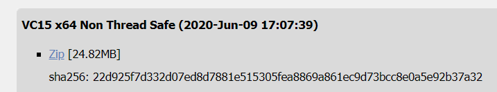

# XSS跨站脚本攻击

-------------------
## 实验要求 
-------------------
* 在vscode中安装一php插件
* 编写一个简单的php脚本，并调试运行
* 将用户的表单输入写入到html文件。在通过浏览器访问这个html文件
## 实验环境
* Windows系统10 ×64
## 实验过程
### 在vscode中安装一php插件
1. 下载`php-7.4.7-Win32-vc15-x64 Thread Safe`

2.解压到E盘，` php.ini-development `改名为`php.ini`,然后修改配置信息
* 取消`extension_dir = "ext"`的注释
* PHP的根目录改为绝对路径
* 将`E:\php`添加至环境变量

3. 在vscode上运行phpserver插件
### XSS实施过程
**原理**:恶意攻击者往Web页面里插入恶意Script代码，当用户浏览该页之时，嵌入其中Web里面的Script代码会被执行，从而达到恶意攻击用户的目的。
1. 编写一个简单的留言板输入页面
2. 在留言内容中加一行
`<script>alert(“hey!you are attacked”)</script>`
之后就变成
```html
<html>
<body>
    <form method="post" action="index.php">
        <input type="text" name="name">
        <button>提交</button>
    </form>
</body>
</html>
```
界面
<html>
<body>
    <form method="post" action="index.php">
        <input type="text" name="name">
        <button>提交</button>
    </form>
</body>
</html>
当浏览器解析到用户输入的代码之后然后会显示


因为浏览器并不知道这些代码改变了原本程序的意图，依然会按照现有的代码弹出这样一个信息框。
