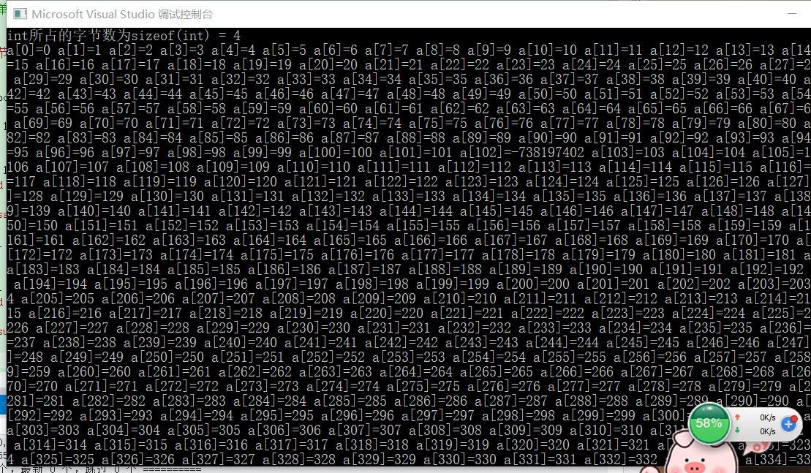
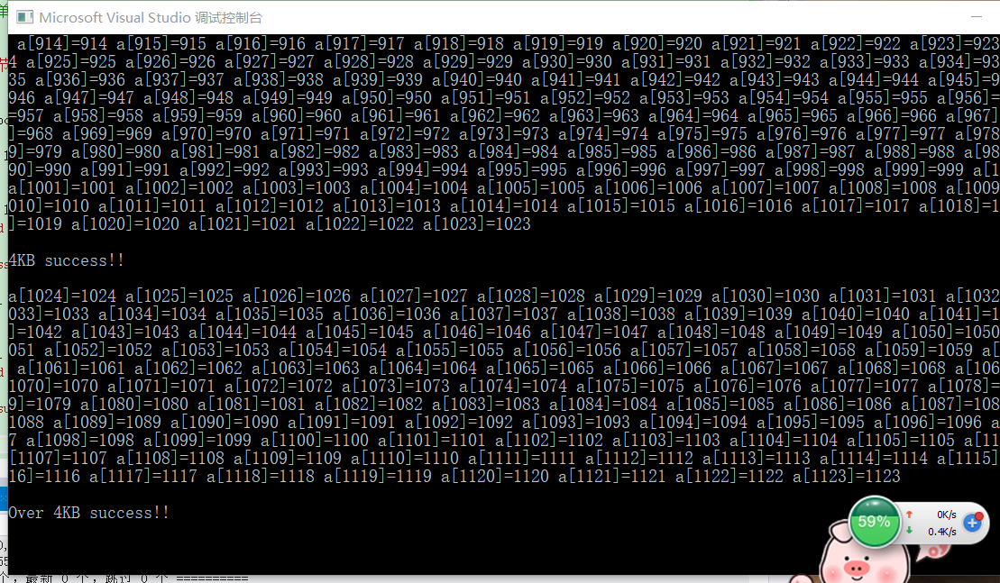
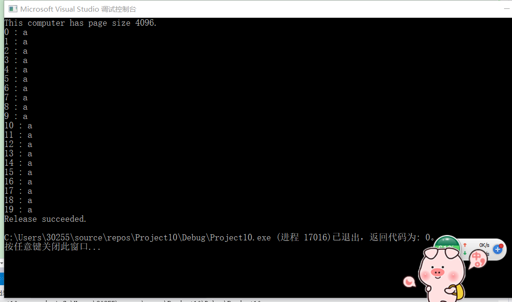
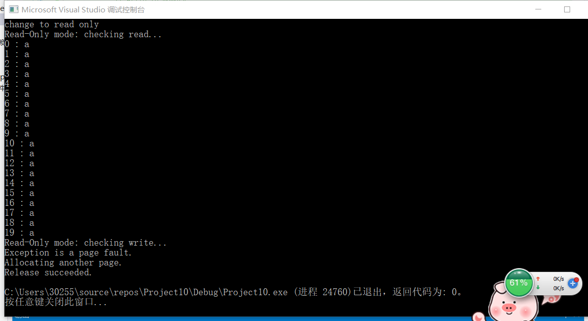

# 内存管理
## 实验要求
* 阅读`VirtualAlloc`、`VirtualFree`、`VirtualProtect`等函数的官方文档
* 编程使用`malloc`分配一段内存，测试是否这段内存所在的整个4KB都可以写入读取。
* 使用`VirtualAlloc`分配一段，可读可写的内存，写入内存，然后将这段内存改为只读，再读数据和写数据，看是否会有异常情况。然后`VirtualFree`这段内存，再测试对这段内存的读写释放正常。
## 实验过程
## 内存管理
* 笔记
   * 以4KB（页）作为基本管理单元的虚拟内存管理。
  * 虚拟内存管理是一套虚拟地址和物理地址对应的机制。
  * 程序访问的内存都是虚拟内存地址，由CPU自动根据系统内核区中的地址对应关系表（分页表）来进行虚拟内存和物理内存地址的对应。
  * 每个进程都有一个分页表。
  * 每个进程都有一个完整的虚拟内存地址空间，x86情况下为4GB（0x00000000-0xffffffff）
  * 但不是每个地址都可以使用（虚拟内存地址没有对应的物理内存）
  * 使用VirtualAlloc API可以分配虚拟内存（以页为单位）、使用VirtualFree释放内存分页。
  * 使用VirtualProtect 修改内存也保护属性（可读可写可执行）
  * 数据执行保护（DEP）的基本原理
  * malloc和free等C函数（也包括HeapAlloc和HeapFree等）管理的是堆内存，堆内存区只是全部内存区的一个部分。
  * 堆内存管理是建立在虚拟内存管理的机制上的二次分配。
  * 真正的地址有效还是无效是以分页为单位的。
  * 内存分页可以直接映射到磁盘文件（FileMapping）、系统内核有内存分页是映射物理内存还是映射磁盘文件的内存交换机制。
  * 完成内存分页管理的相关实验
##  实验过程
* 分配内存代码
```c
#include<stdio.h>
#include<malloc.h>
int main()
{

    printf("int所占的字节数为sizeof(int) = %d\n", sizeof(int));
    int len1 = 1e2;
    int len2 = 1024;
    int* a = (int*)malloc(sizeof(int) * len1);
    // 4KB以内
    for (int i = 0; i < len2; i++) {
        a[i] = i;
    }
    for (int i = 0; i < len2; i++) {
        printf("a[%d]=%d ", i, a[i]);
    }
    puts("\n\n4KB success!!\n");
    // 超过4KB
    for (int i = len2; i < len2 + 100; i++) {
        a[i] = i;
    }
    for (int i = len2; i < len2 + 100; i++) {
        printf("a[%d]=%d ", i, a[i]);
    }
    puts("\n\nOver 4KB success!!\n\n");
    return 0;
}
```
  * 实验结果


* 检测读写释放代码
```c
// A short program to demonstrate dynamic memory allocation
// using a structured exception handler.

#include <windows.h>
#include <tchar.h>
#include <stdio.h>
#include <stdlib.h>             // For exit

#define PAGELIMIT 2            // Number of pages to ask for

LPTSTR lpNxtPage;               // Address of the next page to ask for
DWORD dwPages = 0;              // Count of pages gotten so far
DWORD dwPageSize;               // Page size on this computer

INT PageFaultExceptionFilter(DWORD dwCode)
{
	LPVOID lpvResult;

	// If the exception is not a page fault, exit.

	if (dwCode != EXCEPTION_ACCESS_VIOLATION)
	{
		_tprintf(TEXT("Exception code = %d.\n"), dwCode);
		return EXCEPTION_EXECUTE_HANDLER;
	}

	_tprintf(TEXT("Exception is a page fault.\n"));

	// If the reserved pages are used up, exit.

	if (dwPages >= PAGELIMIT)
	{
		_tprintf(TEXT("Exception: out of pages.\n"));
		return EXCEPTION_EXECUTE_HANDLER;
	}

	// Otherwise, commit another page.

	lpvResult = VirtualAlloc(
		(LPVOID)lpNxtPage, // Next page to commit
		dwPageSize,         // Page size, in bytes
		MEM_COMMIT,         // Allocate a committed page
		PAGE_READWRITE);    // Read/write access
	if (lpvResult == NULL)
	{
		_tprintf(TEXT("VirtualAlloc failed.\n"));
		return EXCEPTION_EXECUTE_HANDLER;
	}
	else
	{
		_tprintf(TEXT("Allocating another page.\n"));
	}

	// Increment the page count, and advance lpNxtPage to the next page.

	dwPages++;
	lpNxtPage = (LPTSTR)((PCHAR)lpNxtPage + dwPageSize);

	// Continue execution where the page fault occurred.

	return EXCEPTION_CONTINUE_EXECUTION;
}

VOID ErrorExit(LPTSTR lpMsg)
{
	_tprintf(TEXT("Error! %s with error code of %ld.\n"),
		lpMsg, GetLastError());
	exit(0);
}

VOID _tmain(VOID)
{
	LPVOID lpvBase;               // Base address of the test memory
	LPTSTR lpPtr;                 // Generic character pointer
	BOOL bSuccess;                // Flag
	DWORD i;                      // Generic counter
	SYSTEM_INFO sSysInfo;         // Useful information about the system

	GetSystemInfo(&sSysInfo);     // Initialize the structure.

	_tprintf(TEXT("This computer has page size %d.\n"), sSysInfo.dwPageSize);

	//dwPageSize = sSysInfo.dwPageSize;
	dwPageSize = 10;

	// Reserve pages in the virtual address space of the process.

	lpvBase = VirtualAlloc(
		NULL,                 // System selects address
		PAGELIMIT * dwPageSize, // Size of allocation
		MEM_RESERVE | MEM_COMMIT,          // Allocate reserved pages
		PAGE_READWRITE);       // Protection = no access
	if (lpvBase == NULL)
		//ErrorExit(TEXT("VirtualAlloc reserve failed."));
		ErrorExit(LPTSTR("VirtualAlloc reserve failed."));

	lpPtr = lpNxtPage = (LPTSTR)lpvBase;

	// Use structured exception handling when accessing the pages.
	// If a page fault occurs, the exception filter is executed to
	// commit another page from the reserved block of pages.

	for (i = 0; i < PAGELIMIT * dwPageSize; i++)
	{
		__try
		{
			// Write to memory.

			lpPtr[i] = 'a';
		}

		// If there's a page fault, commit another page and try again.

		__except (PageFaultExceptionFilter(GetExceptionCode()))
		{

			// This code is executed only if the filter function
			// is unsuccessful in committing the next page.

			_tprintf(TEXT("Exiting process.\n"));

			ExitProcess(GetLastError());

		}

	}

	for (i = 0; i < PAGELIMIT * dwPageSize; i++)
	{
		// Read from the memory
		printf("%d : %c\n", i, lpPtr[i]);
	}

	// Release the block of pages when you are finished using them.

	bSuccess = VirtualFree(
		lpvBase,       // Base address of block
		0,             // Bytes of committed pages
		MEM_RELEASE);  // Decommit the pages

	_tprintf(TEXT("Release %s.\n"), bSuccess ? TEXT("succeeded") : TEXT("failed"));

}
```
 * 运行结果
  
* 只读代码
```
// A short program to demonstrate dynamic memory allocation
// using a structured exception handler.

#include <windows.h>
#include <tchar.h>
#include <stdio.h>
#include <stdlib.h>             // For exit

#define PAGELIMIT 2            // Number of pages to ask for

LPTSTR lpNxtPage;               // Address of the next page to ask for
DWORD dwPages = 0;              // Count of pages gotten so far
DWORD dwPageSize;               // Page size on this computer

INT PageFaultExceptionFilter(DWORD dwCode)
{
    LPVOID lpvResult;

    // If the exception is not a page fault, exit.

    if (dwCode != EXCEPTION_ACCESS_VIOLATION)
    {
        _tprintf(TEXT("Exception code = %d.\n"), dwCode);
        return EXCEPTION_EXECUTE_HANDLER;
    }

    _tprintf(TEXT("Exception is a page fault.\n"));

    // If the reserved pages are used up, exit.

    if (dwPages >= PAGELIMIT)
    {
        _tprintf(TEXT("Exception: out of pages.\n"));
        return EXCEPTION_EXECUTE_HANDLER;
    }

    // Otherwise, commit another page.

    lpvResult = VirtualAlloc(
        (LPVOID)lpNxtPage, // Next page to commit
        dwPageSize,         // Page size, in bytes
        MEM_COMMIT,         // Allocate a committed page
        PAGE_READWRITE);    // Read/write access
    if (lpvResult == NULL)
    {
        _tprintf(TEXT("VirtualAlloc failed.\n"));
        return EXCEPTION_EXECUTE_HANDLER;
    }
    else
    {
        _tprintf(TEXT("Allocating another page.\n"));
    }

    // Increment the page count, and advance lpNxtPage to the next page.

    dwPages++;
    lpNxtPage = (LPTSTR)((PCHAR)lpNxtPage + dwPageSize);

    // Continue execution where the page fault occurred.

    return EXCEPTION_CONTINUE_EXECUTION;
}

VOID ErrorExit(LPTSTR lpMsg)
{
    _tprintf(TEXT("Error! %s with error code of %ld.\n"),
        lpMsg, GetLastError());
    exit(0);
}

VOID _tmain(VOID)
{
    LPVOID lpvBase;               // Base address of the test memory
    LPTSTR lpPtr;                 // Generic character pointer
    BOOL bSuccess;                // Flag
    DWORD i;                      // Generic counter
    SYSTEM_INFO sSysInfo;         // Useful information about the system

    GetSystemInfo(&sSysInfo);     // Initialize the structure.

    _tprintf(TEXT("This computer has page size %d.\n"), sSysInfo.dwPageSize);

    //dwPageSize = sSysInfo.dwPageSize;
    dwPageSize = 10;

    // Reserve pages in the virtual address space of the process.

    lpvBase = VirtualAlloc(
        NULL,                 // System selects address
        PAGELIMIT * dwPageSize, // Size of allocation
        MEM_RESERVE | MEM_COMMIT,          // Allocate reserved pages
        PAGE_READWRITE);       // Protection = no access
    if (lpvBase == NULL)
        //ErrorExit(TEXT("VirtualAlloc reserve failed."));
        ErrorExit(LPTSTR("VirtualAlloc reserve failed."));

    lpPtr = lpNxtPage = (LPTSTR)lpvBase;

    // Use structured exception handling when accessing the pages.
    // If a page fault occurs, the exception filter is executed to
    // commit another page from the reserved block of pages.

    // 具有可读可写的权限

    for (i = 0; i < PAGELIMIT * dwPageSize; i++)
    {
        __try
        {
            // Write to memory.

            lpPtr[i] = 'a';
        }

        // If there's a page fault, commit another page and try again.

        __except (PageFaultExceptionFilter(GetExceptionCode()))
        {

            // This code is executed only if the filter function
            // is unsuccessful in committing the next page.

            _tprintf(TEXT("Exiting process.\n"));

            ExitProcess(GetLastError());

        }

    }
    
    for (i = 0; i < PAGELIMIT * dwPageSize; i++)
    {
        // Read from the memory
        printf("%d : %c\n", i, lpPtr[i]);
    }

    // 将这段内存改为只读
    puts("change to read only");
    DWORD dwOldProtect = PAGE_READWRITE;
    BOOL change_to_readonly = VirtualProtect(
        lpvBase,                 
        PAGELIMIT * dwPageSize, 
        PAGE_READONLY,          
        &dwOldProtect);
    if (change_to_readonly == FALSE)
        //ErrorExit(TEXT("VirtualAlloc reserve failed."));
        ErrorExit(LPTSTR("Page change to read only failed."));

    puts("Read-Only mode: checking read...");
    for (i = 0; i < PAGELIMIT * dwPageSize; i++)
    {
        // Read from the memory
        printf("%d : %c\n", i, lpPtr[i]);
    }
    puts("Read-Only mode: checking write...");
    for (i = 0; i < PAGELIMIT * dwPageSize; i++)
    {
        __try
        {
            // Write to memory.

            lpPtr[i] = 'a';
        }

        // If there's a page fault, commit another page and try again.

        __except (PageFaultExceptionFilter(GetExceptionCode()))
        {

            // This code is executed only if the filter function
            // is unsuccessful in committing the next page.

            _tprintf(TEXT("Exiting process.\n"));

            ExitProcess(GetLastError());

        }
    }

    // Release the block of pages when you are finished using them.

    bSuccess = VirtualFree(
        lpvBase,       // Base address of block
        0,             // Bytes of committed pages
        MEM_RELEASE);  // Decommit the pages

    _tprintf(TEXT("Release %s.\n"), bSuccess ? TEXT("succeeded") : TEXT("failed"));

}
```
* 运行结果
   
## 总结
* 由 VirtualAlloc 分配的 PAGE_READWRITE（可读可写）内存可以正常的写入和读取
* 将访问属性修改为 PAGE_READONLY 后，该段内存无法写入，但可以正常读取
* 使用 VirtualFree 之后，该段内存无法进行写入和读取
