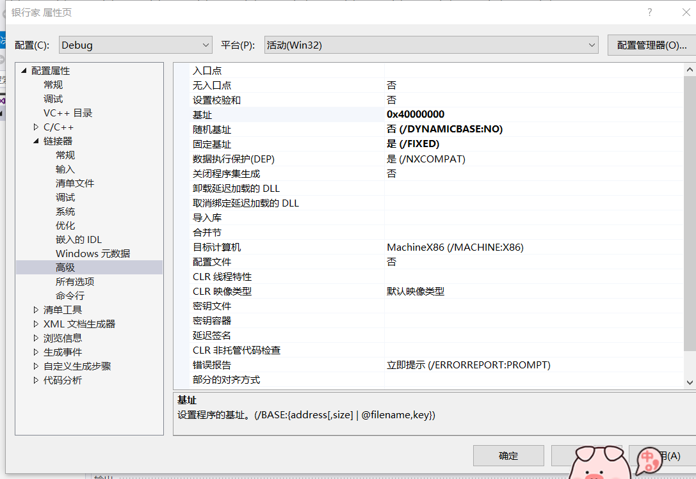
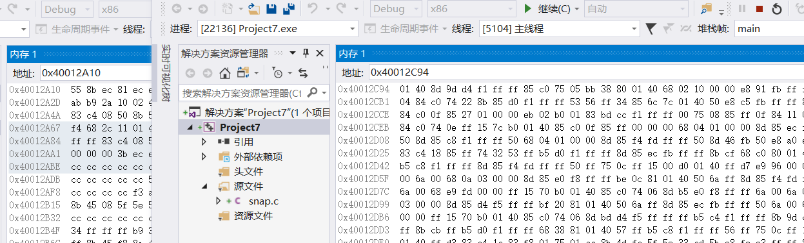

# 虚拟地址
 * [x] 验证不同进程的相同的地址可以保存不同的数据
   * [x] 在 VS 中，设置固定基地址，编写两个不同的可执行文件。同时运行这两个文件。然后使用调试器附加到两个程序的进程，查看内存，看两个程序是否使用了相同的内存地址
   * [ ] 在不同的进程中，尝试使用 VirtualAlloc 分配一块相同地址的内存，写入不同的数据。再读出
 * [ ] 配置一个 Windbg 双机内核调试环境，查阅 Windbg 的文档，了解
   * [ ] Windbg 如何在内核调试情况下看物理内存，也就是通过物理地址访问内存
   * [ ] 如何查看进程的虚拟内存分页表，在分页表中找到物理内存和虚拟内存的对应关系。然后通过 Windbg 的物理内存查看方式和虚拟内存的查看方式，看同一块物理内存中的数据情况

## 实验过程
* 固定基地址查看运行时的内存
   * 两个项目： ProjectA 和 ProjectB 都设置了相同的基地址
  
  
结论:虽然两个基地址都设置成了`0x40000000`,但两个程序还是可以同时被调试，由此可见设置的这个基地址只是虚拟地址。
* 使用VirtualAlloc分配一块相同地址的内存，写入不同的数据再读出
代码部分
```c
#include <windows.h>
#include <tchar.h>
#include <stdio.h>
#include <stdlib.h>             // For exit

int main() {
	printf("Demo A virtualalloc\n");

	LPVOID lpvBase;               // Base address of the test memory
	LPTSTR lpPtr;                 // Generic character pointer
	BOOL bSuccess;                // Flag
	DWORD i;                      // Generic counter
	SYSTEM_INFO sSysInfo;         // Useful information about the system

	GetSystemInfo(&sSysInfo);     // Initialize the structure.

	DWORD dwPageSize = sSysInfo.dwPageSize;
	// dwPageSize = 4096
	printf("%d\n", dwPageSize);

	// Reserve pages in the virtual address space of the process.
	int PAGELIMIT = 1;

	lpvBase = VirtualAlloc(
		(LPVOID)0x40000000,                 // System selects address
		PAGELIMIT*dwPageSize, // Size of allocation
		MEM_RESERVE | MEM_COMMIT,          // Allocate reserved pages
		PAGE_READWRITE);       // Protection = no access
	if (lpvBase == NULL)
	{
		_tprintf(TEXT("Error! %s with error code of %ld.\n"), TEXT("VirtualAlloc reserve failed."), GetLastError());
		exit(0);
	}

	lpPtr = (LPTSTR)lpvBase;

	// Write to memory.
	for (i = 0; i < PAGELIMIT*dwPageSize; i++) {
		lpPtr[i] = 'a';
	}

	// Read from memory
	for (i = 0; i < PAGELIMIT*dwPageSize; i++) {
		printf("%c", lpPtr[i]);
	}

	bSuccess = VirtualFree(
		lpvBase,       // Base address of block
		0,             // Bytes of committed pages
		MEM_RELEASE);  // Decommit the pages

	_tprintf(TEXT("\nRelease %s.\n"), bSuccess ? TEXT("succeeded") : TEXT("failed"));

	return 0;
}
```

